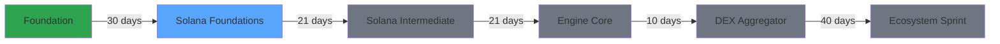

<div align="center">
  


# **Rust + Solana: From Zero**

**A public, day-by-day engineering log**

*From "Hello, Rust" to production-grade backends to on-chain programs on Solana*

[](LICENSE)
[](https://www.rust-lang.org/)
[](https://solana.com/)
[](#)

</div>

---

## TL;DR

> **One monorepo. Six phases. Daily verifiable progress.**

| Phase | Duration | Status | Focus |
|-------|----------|--------|-------|
| **1. Rust Foundation** | 30 days |  | Core Rust mastery |
| **2. Solana Foundations** | 21 days |  | On-chain core + off-chain scaffold |
| **3. Solana Intermediate** | 21 days |  | Escrow/CPI/security + prod hardening |
| **4. Engine Core** | 10 days |  | Pipeline abstractions + runtime primitives |
| **5. DEX Aggregator** | 40 days |  | On-chain routing + off-chain realtime engine |
| **6. Ecosystem Sprint** | 10 days |  | PRs, bounties, grants, visibility |

---

## Roadmap



---

## Daily Format

**Stages 1-4:**
```
5h Solana development
2h Off-chain production kit
0.5h Public log
```

---

## Repository Structure

```
rust-solana-from-zero/
|-- foundation/                    # 30-day Rust foundation (archived)
|-- solana/
|   |-- stage1-foundations/        # On-chain core + off-chain scaffold
|   |   |-- notes/                 # Daily learning notes
|   |   |-- programs/              # Anchor/native programs
|   |   |-- offchain/              # Axum/SQLx service
|   |-- stage2-intermediate/       # Escrow, CPI, security
|   |-- stage3-engine-core/        # Pipeline abstractions
|   |-- stage4-dex-aggregator/     # DEX routing engine
|   |-- stage5-ecosystem-sprint/   # PRs, bounties, grants
|-- README.md
```

### Key Principles

| Rule | Description |
|------|-------------|
| **Real Artifacts** | Every `dayXX` folder ships code, notes, and tests |
| **Reproducible** | Clone build test works for every day |
| **Daily README** | Each day has its own DevLog with focus, tasks, invariants, tests, decisions |
| **No Empty Folders** | If there's a folder, there's real code or notes |

---

## Phase Specifications

| Stage | Spec | Focus |
|-------|------|-------|
| **Rust Foundation** | [`foundation/README.md`](foundation/README.md) | Core Rust fundamentals |
| **Solana Foundations** | [`solana/stage1-foundations/README.md`](solana/stage1-foundations/README.md) | On-chain basics |
| **Solana Intermediate** | [`solana/stage2-intermediate/README.md`](solana/stage2-intermediate/README.md) | Advanced patterns |
| **Engine Core** | [`solana/stage3-engine-core/README.md`](solana/stage3-engine-core/README.md) | Runtime primitives |
| **DEX Aggregator** | [`solana/stage4-dex-aggregator/README.md`](solana/stage4-dex-aggregator/README.md) | Full DEX implementation |
| **Ecosystem Sprint** | [`solana/stage5-ecosystem-sprint/README.md`](solana/stage5-ecosystem-sprint/README.md) | Community contribution |

Each spec defines: blocks, days, Go/No-Go criteria, and required artifacts.

---

## Branching Strategy

| Branch | Status |
|--------|--------|
| `foundation` | Frozen (completed) |
| `stage1-foundations` | Active |
| `stage2-intermediate` | Pending |
| `stage3-engine-core` | Pending |
| `stage4-dex-aggregator` | Pending |
| `stage5-ecosystem-sprint` | Pending |

> `main` branch stays clean and points to the current active stage.

---

## DevLog Rules

> **Non-negotiable principles for this repository**

| Rule | Description |
|------|-------------|
| **Daily Commits** | One day = one meaningful commit (plus tiny fixes) |
| **No Fake Progress** | No empty day folders, no placeholder content |
| **No Panics** | No `unwrap()` / `expect()` in production paths |
| **Edge Cases** | Negative and edge-case tests are mandatory |
| **Typed Errors** | `thiserror` + `Display` for human-readable messages |
| **Clean Architecture** | Domain / app / infra boundaries don't leak |
| **English First** | Documentation accessible to any engineer |
| **Reproducibility** | Clone build test must work everywhere |
| **Friday Logs** | Decision log (8-10 lines) every Friday |

---

## Who This Is For

- **Future me** - a time capsule of learning
- **Reviewers / Leads** - transparent progress tracking
- **Anyone** wanting a real Rust Solana path without marketing noise

---

## License

<div align="center">

[](LICENSE)

This project is licensed under the MIT License - see the [LICENSE](LICENSE) file for details.

---

**Built with determination and a lot of coffee**

[Start from Day 1](foundation/) | [Current Progress](solana/stage1-foundations/)

</div>